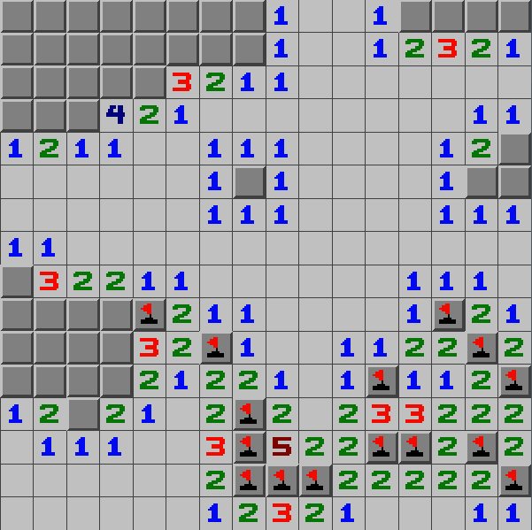

<h1>Semesteroppgave 2 i INF101</h1>

<h3>Laget av Florian ten Napel (flnap0022) April - 2024</h3>

  <h2><a href=https://youtu.be/0UFFt_yu-Xs>Video</a></h2>

  
Til programmet har jeg tatt utgangspunkt i det tomme repo'et, men har brukt den genersiske grid pakken fra lab 5.
På denne måten fikk jeg et veldig enkelt og oversiktlig prosjekt som fortsatt gjenbrukte kode på en hensiktsmessig måte.
Kompleksiteten på prosjektet er noen hakk ned fra tetris, men dette er rett og slett fordi prosjektet måtte ferdigstilles til samme dag jeg hadde eksamen.
Jeg hadde blant annet ønsker om å la brukeren velge vanskelighetsgrad og legge til musikk og animasjoner, men jeg fikk det aldri til å bli sånn som jeg ønsket i tide.

  
Kjernen i programmet ligger i Model og Minefield klassene, Minefield arver fra Grid og plasserer først et gitt antall miner tilfeldig på et grid for så å regne hvor mange miner som
ligger inntil hver rute i rutenettet. Når dette er gjort kan brukeren klikke på hver rute for å enten markere den med ett flagg (høyreklikk) eller se på ruten (venstreklikk).
Hvis ruten er fri og ikke ligger inntil noen miner så gjøres et BFS (breadth-first search) for å vise alle ledige nærliggende celler. Dersom man klikker på en mine taper en spillet.
Spillet er vunnet dersom en klarer å vise alle ruter som ikke har miner på seg.

  
Bildene er tegnet av meg i Pixilart basert på bilder av Minesweeper på Windows XP

